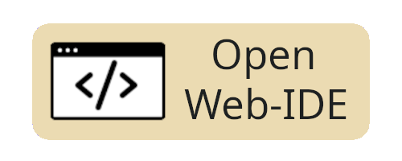

# Chap

</img>

[](https://www.rust-lang.org/)\
[](https://github.com/ali77gh/Chap/actions/workflows/rust.yml)
[](https://github.com/ali77gh/chap/blob/stable/LICENSE)

Chap is an easy to learn, dynamic, interpretive language written in Rust.

The Chap joke: Chap is like **Communism**✊, It's useless and people think it's because it's not implemented correctly 🫳🏻🎤, (We need to test it on an smaller society first).

Besides the comedy part, It actually does have some cool new Ideas about programming languages in general.

<a href="https://ali77gh.github.io/ChapApp">
    
</a>

[ChapApp](https://github.com/ali77gh/chapAPP) the WebIDE (WASM).

## Table of content

1. [Why was it named 'Chap'?](#name)
1. [Features](#features)
1. [Keywords](#keywords)
1. [Syntax](#syntax)
1. [Operators](#operators)
1. [ControlFlow](#control-flow)
1. [Samples](#samples)
1. [Data Types](#datatypes)
1. [Memory Management](#memory-management)
1. [Installation](#installation)
1. [How to use](#how-to-use)
1. [Builtin function](#builtin-functions)

## Name

Rust or راست in persian means right and Chap or چپ means left.

Chap unlocks **Two-Dimensional** Full Stack Development. Front⬆️End, Back⬇️End, Rust➡️End, Chap⬅️End.

## Features

1. Easy to learn and fun to code (hard to code, honestly).
2. Keyword-less
3. Actually left-to-right syntax
4. Cross platform (It runs on Linux, MacOS, Windows, Web(WASM))
5. **Chap-to-C compiler** (v3.0.0) — compile Chap code directly to native executables
6. **Optimized runtime** with unsafe hashmap, union-based internals, and zero-clone execution

## What's new in 3.0.0

- **Chap-to-C compiler** — write Chap, compile to C, then to a native binary
- **All interpreter functions** — full coverage of built-in functions
- **Performance** — unsafe fast hashmap, union-based optimization, no-clone execution
- **Benchmark suite** — track performance over time
- **Bug fixes** — `jump_if_equal` / `jump_if_not_equal` edge cases, WASM compilation, unreachable code warnings

## Keywords

What makes a programming language hard to learn?

```chp
"Keywords"
```

There are no keywords in Chap.

## Syntax

There is only one syntax in Chap, Other ones are just sugar syntaxes.

A normal line of code in chap has 3 chunks separated with -> operator:

```chp
chunk1 -> chunk2 -> chunk3
```

| Chunk 1      | Chunk 2       | Chunk 3         |
| ------------ | ------------- | --------------- |
| input params | function name | output variable |

```chp
param1, param2 -> function_name -> $output_variable
```

For example:

```chp
1, 2 -> add -> $sum
```

1 and 2 separated by "," are input params.\
These input params are moving to "add" function.\
Finally $sum is a variable that holds the add result in it.

Note: "add" is not a keyword, it's a builtin function.

## Ok but why?

English language is a **"left to right"** (aka LTR) language, and programming languages should follow the same rule, right?

Wrong:

```javascript
// c base languages:
result = send(sqrt(1 + 2).toString());
   ↑       ↑    ↑     ↑       ↑
   5       4    2     1       3
```

But chap:

```chp
// chap
1,2 -> add -> sqrt -> to_string -> send -> $result
        ↑       ↑         ↑          ↑        ↑
        1       2         3          4        5
```

This is actually left to right like normal english.

Note: "Chain" syntax is added in version 2.0.0

## Syntax Rules

Make a comment with // and anything you write on the right side will be ignored by compiler.

```chp
1, 2 -> add -> $sum // this is a comment
```

You can write many lines of code in one line by separating lines by ";"

```chp
1 -> $a; $a, 2-> sum -> $b; $b -> print -> $_
```

Input params are separated by comma character ",".

Input params can be:

1.  Variable
1.  String with " character around like: "hello world"
1.  Int just a number: 5
1.  Float just a normal form of floating point number 3.14
1.  Bool is a boolean value which is a true or false
1.  Tags start with @. [(more on control flow)](#control-flow)
1.  Lists can be created like this: [ 1 "hello" "world"] (space separated).
1.  Maps can be created like this: {"name":"Ali" "age":26} (space separated)

```chp
$a, "hello", 5, 3.14, false -> function_name -> $output_var
```

Function names are not case-sensitive.

Function names are not sensitive about anything else:

```chp
// to_string = ToString = TOSTRING = to string = t o s t r_i_n_g
```

Variables should start with $ which is known as the most loved feature of PHP.

Variable name rules:

```chp
$12 // Ok
$sp a ce // OK
$#^3 // Ok
$a,b // comma not allowed
$really? // question mark at the end not allowed
$rea?lly // OK
$some->thing // "->" is not allowed
```

## Sugar syntaxes

If a function has no output variable you can remove chunk3:

```chp
"hello world" -> print
    ↑              ↑         ↑
   input         function   removed chunk3
```

If a function has no input param you can remove chunk1:

```chp
              input -> $user_input
 ↑              ↑         ↑
nothing      function    output
```

Removing chunk2 (function name) means assigning a variable:

```chp
1 -> $variable
// it's actually short for:
// 1 -> assign -> $variable
```

If a function has no input param and output_var you just write function name:

```chp
exit
```

If a function has output var but you removed chunk3 the result of function will get printed:

```chp
1, 2 -> add
// it's short for:
// 1, 2 -> add -> print
```

If you just write some params. chap will print them:

```chp
1, 2
// result: 1, 2

// or
$a
// prints whatever $a is
```

As you can guess, we have the world's smallest hello world:

```chp
"Hello World"
```

I wish I could remove double quotes too :)

## Chain syntax (aka pipe)

Sometimes you have a collection of function calls like this:

```chp
1, 2 -> add -> $tmp1
$tmp1 -> sqrt -> $tmp2
$tmp2 -> print
```

As you can see, output of a function call is input of the next function call.

In this case, you can use piping syntax to write functions next to each other and get rid of temp variables:

```chp
1, 2 -> add -> sqrt -> print
```

## Parentheses

You can't use Piping when one of the functions has more than one param.

```chp
1,2 -> add -> add -> print
               ↑
               This needs two input params
```

In this case you can use Parentheses:

```chp
(1,2 -> add), (3 -> sqrt) -> add -> print
```

This converts two:

```chp
1,2 -> add -> $TMP1
3 -> sqrt -> $TMP2
$TMP1, $TMP2 -> add -> print
```

## Operators

There is one operator -> which moves data from left to right and it is language logo.

Why are operators bad?\
Because they behave different with different types.
Look at this python example:

```python
number = input("Enter a number:")
result = number * 5 # multiply number by 5
print(number, "* 5 =", result)
```

Following code has a bug and the result will be:

```python
Enter a number: 3
3 * 5 = 33333
# no runtime error
```

Why? Because Python uses the same operator for math.multiply and strings.repeat.

So \* operator **"IS NOT A TYPE SAFE"** operator and it will **"DO UNEXPECTED THINGS"** when your forget to pass the right type to it and it will happen without throwing runtime errors (which is bad).

Same code in Chap:

```chp
input -> $number
$number, 5 -> multiply -> $result
$result
// error in line 2: multiply function works only with numbers int and float
```

Runtime errors are much better than logical errors, and in chap we have the repeat function:

```chp
"foo ", 3 -> repeat
// foo foo foo
```

In many languages "+" operator has the same problem:

```python
# Python
def add(a, b):
    a + b # concat or add? both?

add("1", "2") # 12
add(1, 2) # 3
```

```chp
// Chap:
"1", "2" -> concat // 12
1, 2 -> concat // 12 // you can concat integers safely
1, 2 -> add // 3
"1", "2" -> add // runtime error
```

## Debugger

You can put a ? at the end of function name to debug that line:

```chp
1 -> $a
2 -> $b
$a, $b -> add? -> $c
// result 1, 2 -> add -> 3
```

Chap also has a function called "dump" which prints every variable you have.

## Control Flow

You can create a tag like this:

```chp
@tag_name
```

And you can jump to it:

```chp
@tag_name -> jump
// or
@tag_name, true -> jump_if
// or
@tag_name, 1, 1 -> jump_if_equal
// or
@tag_name, 1, 0 -> jump_if_not_equal
```

## loop

Jumping backward makes loops:

```chp
@l
    "Hello until your battery dies"
@l -> jump
```

## if

```chp
@i, 1, 1 -> jump_if_equal
    "this will not print"
@i
```

Note: Indention is not necessary

## Array

Initialize:

```chp
[1 2 3 4] -> $myArray
```

Insert:

```chp
$myArray, 5 -> insert
```

Pop:

```chp
$myArray-> pop -> $last_item
```

Get item by index:

```chp
$myArray, 1 -> get -> $first_item
// arrays index start from 1
```

## Samples

Note: You can test and tweak samples at [ChapApp](https://ali77gh.github.io/ChapApp/).

## hello_world.chp

```chp
"Hello world"
```

```sh
Hello world
```

## counter.chp

```chp
0 -> $counter
@l
    $counter -> increase
@l, $counter, 100 -> jump_if_not_equal
$counter
```

```sh
100
```

## number_guess_game.chp

```chp
1,10 -> random_number -> $answer
@loop
    input -> $guess
    $guess -> to_int -> $guess
    @win, $answer, $guess -> jump_if_equal
    "wrong"
@loop -> jump

@win
"you win"
```

```sh
1
wrong
2
wrong
3
you win
```

## christmas_tree.chp

```chp
0 -> $counter
@loop
    $counter -> increase

    (" ", (10, $counter -> minus) -> repeat),
    ("*", ($counter, 2 -> multiply) -> repeat) ->
    cat
@loop, $counter, 10 -> jump if not equal
```

```sh
         **
        ****
       ******
      ********
     **********
    ************
   **************
  ****************
 ******************
********************
```

## DataTypes

```chp
1 -> type_of
int

3.14 -> type of
float

"ali" -> TypeOf
string

true -> type
boolean

-> [1 2 3] -> type
list

-> {"name":"Ali"} -> type
map
```

## Memory Management

Your OS will free memory after process is done!

## Installation

### Download release

[link](https://github.com/ali77gh/Chap/releases)

### Build from source

```bash
git clone https://github.com/ali77gh/Chap
cargo build --release
sudo cp ./target/release/chap /usr/bin
```

## How To Use

### REPL (Run Execute Print Loop)

[./repl/mod.rs](https://github.com/ali77gh/Chap/blob/stable/src/repl/mod.rs)

```bash
❯ chap
-> "hello world"
hello world
->
```

### File_executor

[./file_executor/mod.rs](https://github.com/ali77gh/Chap/blob/stable/src/file_executor/mod.rs)

```bash
❯ chap number_guess_game.chp
1
wrong
2
wrong
3
you win answer was: 3
```

### Use As lib

[./lib.rs](https://github.com/ali77gh/Chap/blob/stable/src/lib.rs)

```bash
cargo add chap # this include eval function
```

## Builtin Functions

[builtin function docs](https://github.com/ali77gh/Chap/tree/stable/src/runtime/builtin_function)

## Stars

[](https://starchart.cc/ali77gh/chap)
